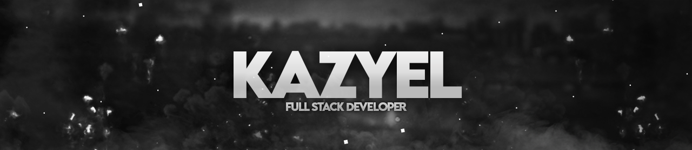

 

<h4 align="center"> Yo! I'm Mateus Mascarelo, also known as Kazyel in the internet, a current Computer Science student and Front/Back-end enthusiast.</h4>

> 
My love with programming started since I was younger, always got fascinated about everything that computers, internet and games could provide to the world. This passion, put together with my incessant will to solve problems, there would be no way to have doubts of what I want to be. So, yeah, i'm researching and practicing, overcoming myself everyday and learning forever since then!

> 
Nowadays, i'm very happy working to be a <b>Full Stack Web Developer</b>, primarily Front-end using <b>React/Next.js</b>, <b>Java/TypeScript</b>,<b> TailwindCSS</b> etc. For Back-end, i'm a very beginner, but I know the basics of <b>Node.js</b>, <b>Express</b> and <b>MongoDB/PostgreSQL</b>.

> It's been a lot fun making websites both for profissional projects or just for me so I can keep putting my knowledge in practice as I want. Somewhere in the future, I highly intend to start learning Game Development and/or Design, these two are my greatest passions and they work very well together, hope I can work with both! I already work with some Photoshop, pretty casually but the sufficient to do most of what I need with my projects. 

